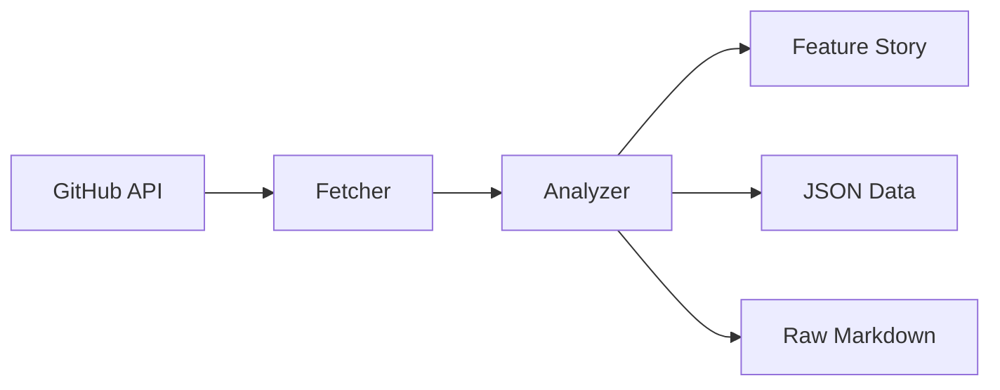

# GitHub Release Notes Analyzer 📊

A powerful TypeScript tool that analyzes GitHub repository release notes to generate a comprehensive feature evolution story. Perfect for understanding how projects evolve, tracking breaking changes, and creating beautiful documentation.

## 🚀 Features

- **Automated Release Analysis**: Fetch and analyze release notes from any GitHub repository
- **Smart Feature Extraction**: Intelligently identifies and categorizes:
  - Major Features & Improvements
  - Breaking Changes
  - Deprecations & Removals
- **Multiple Output Formats**:
  - JSON for programmatic use
  - Raw markdown for preservation
  - Feature story markdown for beautiful documentation
- **Version Handling**: Supports semantic versioning and custom version schemes
- **Rich Markdown Output**: Clean, organized, and readable feature evolution stories

## 🛠️ Quick Start

### Prerequisites

- Node.js (v16 or higher)
- TypeScript
- GitHub Personal Access Token (for API access)

### Installation

```bash
# Clone the repository
git clone https://github.com/yourusername/github-release-analyzer.git
cd github-release-analyzer

# Install dependencies
npm install

# Set up your GitHub token
echo "GITHUB_TOKEN=your_token_here" > src/.env
```

### Usage

```bash
# Basic usage
npx ts-node src/index.ts https://github.com/owner/repo

# Example with a specific repository
npx ts-node src/index.ts https://github.com/facebook/react
```

## 🏗️ Architecture

The project is built with a modular architecture focusing on extensibility and maintainability:

### Core Components

1. **GitHub API Client** (`index.ts`)
   - Handles API communication
   - Manages rate limiting
   - Fetches release data

2. **Release Analyzer** (`analyzer.ts`)
   - Feature extraction engine
   - Version parsing and sorting
   - Markdown generation

3. **Type Definitions** (`types.ts`)
   - Shared interfaces
   - Type safety throughout the codebase

### Data Flow



## 🤝 Contributing

We love contributions! Here's how you can help:

### Development Setup

1. Fork the repository
2. Create a feature branch
3. Install dependencies:
   ```bash
   npm install
   ```
4. Make your changes
5. Run tests:
   ```bash
   npm test
   ```
6. Submit a pull request

### Areas for Contribution

- **Feature Extraction**: Improve the feature detection algorithms
- **New Output Formats**: Add support for different output formats
- **UI Development**: Create a web interface
- **Documentation**: Improve docs and examples
- **Testing**: Add more test cases and improve coverage

## 📁 Project Structure

```
github-release-analyzer/
├── src/
│   ├── index.ts          # Entry point & GitHub API integration
│   ├── analyzer.ts       # Core analysis engine
│   ├── types.ts          # TypeScript type definitions
│   └── .env             # Environment configuration
├── release-notes/        # Generated output directory
├── tests/               # Test suite
└── README.md            # This file
```

## 🔌 API Documentation

### Main Functions

#### `GitHubReleaseAnalyzer`

```typescript
class GitHubReleaseAnalyzer {
  constructor();
  async fetchReleaseNotes(owner: string, repo: string): Promise<ReleaseNote[]>;
  async saveReleaseNotes(owner: string, repo: string): Promise<ReleaseNote[]>;
}
```

#### `ReleaseAnalyzer`

```typescript
class ReleaseAnalyzer {
  constructor(releases: ReleaseNote[], repoName: string);
  generateFeatureStory(): FeatureStory[];
  generateMarkdownSummary(): string;
}
```

### Types

```typescript
interface ReleaseNote {
  tagName: string;
  name: string | null;
  body: string | null;
  createdAt: string;
  url: string;
}

interface FeatureStory {
  version: string;
  date: string;
  majorFeatures: string[];
  breakingChanges: string[];
  deprecations: string[];
}
```

## 📈 Future Roadmap

1. **Enhanced Analysis**
   - Machine learning for better feature extraction
   - Sentiment analysis of changes
   - Impact analysis of breaking changes

2. **New Features**
   - Web UI for easy access
   - GitHub Action integration
   - Custom templating system
   - Automatic changelog generation

3. **Integration Support**
   - CI/CD pipeline integration
   - Documentation site generators
   - Project management tools

## 📝 License

MIT License - feel free to use this project for any purpose!

## 🙏 Contributing Guidelines

1. **Code Style**
   - Use TypeScript
   - Follow ESLint configuration
   - Write meaningful commit messages

2. **Pull Requests**
   - Create an issue first for discussion
   - Reference the issue in your PR
   - Include tests for new features
   - Update documentation as needed

3. **Testing**
   - Write unit tests for new features
   - Ensure all tests pass before submitting
   - Include integration tests where appropriate

## 🤔 Need Help?

- Create an issue for bugs or feature requests
- Join our discussions for questions
- Check out the examples directory for more use cases

Let's make GitHub release analysis better together! 🚀